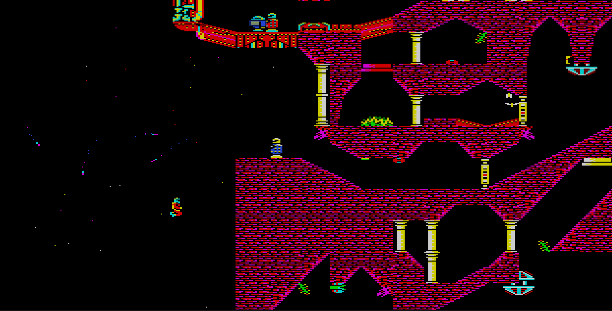
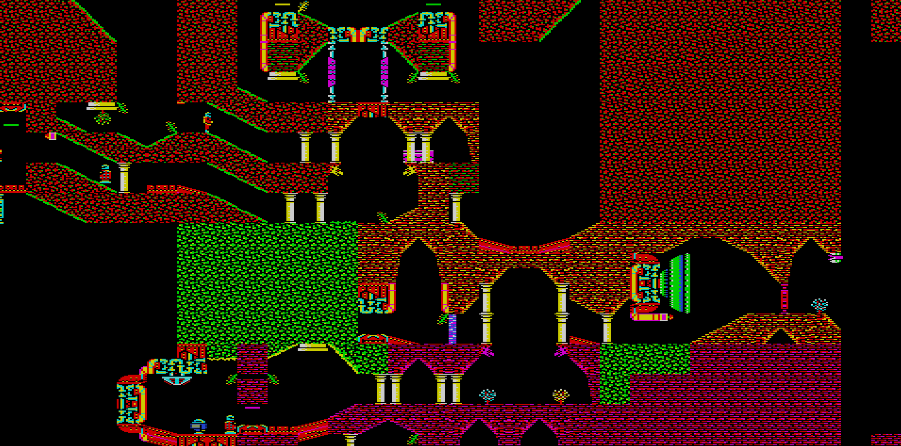
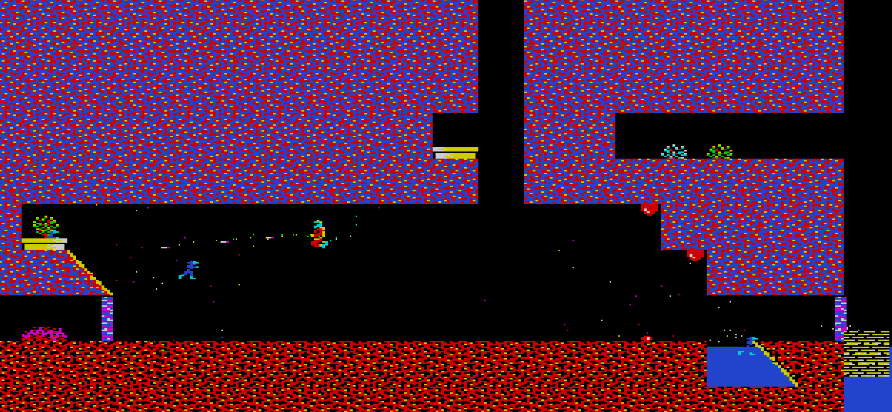

# exile-cpp

[](https://github.com/davidjefferies-stellar/exile-cpp/actions/workflows/tests.yml)



A C++ port of the BBC Micro masterpiece **Exile** (Peter Irvin & Jeremy Smith, 1988),
working from the original 6502 disassembly. 

The goal of the project is purely educational -
to re-author the 6502 in C++ for easier study and to preserve its groundbreaking 
concepts and techniques for a future where people no longer know 6502.

This project is **not** a **remake** or **remaster** or beginnings of a **sequel** to **Exile**. Its is only intended to be playable in-so-far as is necessary to achieve the educational goals of the project. If you wish to play **Exile** from start to finish (and it is very much recommended that you do) then that is best achieved using an original copy of the game running on original hardware or under emulation.

The disassembly used as the spec is the superbly annotated version by Level7 and lives at 
`exile-standard-disassembly.txt`in the project root. All veriable and function names have been retained from this version for easier cross-reference. Each function in C++ is annotated with the original address of the function from this disassembly.

## Build

Visual Studio solution. 

**Command line (MSBuild):**

```
msbuild exile.vcxproj /p:Configuration=Release /p:Platform=x64
```

**Visual Studio 2022 IDE:**

1. Open `exile-cpp.sln` in VS2022 (the solution targets toolset v143 / C++20).
2. The solution contains two projects:
   - **`exile`** — the game (default startup project).
   - **`exile_tests`** — headless test runner (see [Tests](#tests)).
3. Pick the configuration in the toolbar — `Debug | x64` or `Release | x64`
   (only x64 is configured).
4. **Build → Build Solution** (`Ctrl+Shift+B`) or just **Start Debugging** (`F5`)
   to build and launch the game. The exe lands in the `OutDir` set on
   the project (the checked-in path is `D:\Projects\Exile\`; override in
   your local `exile.vcxproj.user` if you want it elsewhere — that file
   is gitignored).
5. The working directory at launch is the project root, so `exile.ini`,
   `exile.map`, `data/`, and `resources/` resolve as-is.

The build pulls in single-header dependencies bundled under `deps/`:

- `sokol_app.h` + `sokol_gfx.h` + `sokol_glue.h` + `sokol_log.h` —
  windowing, input, and a CPU-framebuffer-as-texture present path
  (D3D11 backend on Windows). Hardware-accelerated blit; the per-pixel
  rendering logic stays CPU-side.
- `fenster_audio.h` — audio (Windows backend is bypassed by our own
  `waveOut` implementation in `src/audio/`; the upstream sets `nBlockAlign`
  incorrectly for PCM 16-bit mono).

## Run

```
exile.exe
```

Configuration lives in `exile.ini` — start position, cache sizes, debug
flags, key bindings, and the landscape-generator A/B toggle.

## Controls

| Key            | Action                                    |
|----------------|-------------------------------------------|
| arrows         | move (with jetpack: thrust)               |
| `Q` `W` `P` `L`| jetpack left / right / up / down (arrow-key aliases) |
| `Z`            | toggle jetpack                            |
| Space          | fire selected weapon                      |
| Tab            | turn around                               |
| Left Ctrl / Left Shift | lie down                          |
| Right Ctrl / `[`       | jetpack booster (held = 2× thrust) |
| `,` `M` `.`    | pick up / drop / throw held object        |
| `S` / `G`      | store in pocket / retrieve from pocket    |
| `R` / `T`      | remember position / teleport to it        |
| `I` `K` `O`    | aim centre / down / up                    |
| `1`–`5`        | select weapon slot                        |
| `Y` / `U`      | whistle one / two                         |
| Esc            | pause                                     |
| `;` / `'`      | save game state / load game state         |
| `\`            | save current landscape to `exile.map`     |
| mouse wheel    | zoom                                      |
| right-drag     | pan camera (map mode)                     |
| left-click     | tile info / toggle bottom-HUD checkbox    |

Map-mode toggle and the rest of the debug overlays (tile grid, object
labels, switch / transporter wires, collision shading, debug text) live
on the bottom-HUD checkboxes — click them to toggle.



## Map save / load

The 256×256 landscape grid lives in `exile.map`. Press `\` to write the
current grid (post-bake, plus any tertiary edits) — a short "Saved
exile.map" / "Save FAILED" banner confirms the write.

**When does the map load procedurally vs. from disk?**

`Game::init` always tries `landscape_.load_from_file("exile.map")` first.
If that file exists and parses cleanly, the game uses it. If it's
missing or invalid, the game falls back to `landscape_.bake()` — the
procedural generator that derives the entire grid from the seed in
`exile.ini`. Either way the rest of the game (tertiary spawning,
collision, rendering) doesn't care whether the grid came from disk or
algorithm.

So: delete (or rename) `exile.map` to get the procedural map; press `\`
once to capture the current grid and the game will load that one
forever after.

## Game save / load

Game state (everything *except* the landscape) is saved and loaded
separately. Two formats, auto-detected by file size:

- **Native text format** (any size other than 1024 bytes). Human-readable
  `[player] [events] [object N] [secondary N] [rng]` sections. Press `;`
  to write the current state to `exile.sav`; press `'` to load it back.
  The landscape isn't persisted — it's deterministic from the seed (or
  comes from `exile.map`, see the section above) — so the save only
  needs the mutable state (frame counter, RNG, player, the 16 primary
  and 32 secondary slots, 235 bytes of tertiary data, particles, input).

- **BBC binary format** (exactly 1024 bytes). The original Exile save
  layout: 0x37e bytes of XOR-streamed (BCD-keyed) state followed by
  0x82 bytes of page-align padding. `Game::load_bbc_save` decrypts via
  a port of the supervisor's `&2f80 decrypt_temporary_copy_of_game_state`
  and rejects the file if the trailing `player_teleports_x/_y` spawn
  pair or the checksum at offset 0x35a don't match. Once decrypted, the
  layout maps to supervisor memory `&1a20..&1d9d` — the same range the
  real BBC's load routine writes into.

Both formats are loaded the same way. Open the **Saves** panel via the
HUD checkbox to see a scrollable list of `save_disks/*.sav` files
(numeric sort, mouse + arrow-key navigation); click a row or press
Enter to load. The load path probes the file size: 1024 bytes means
BBC, anything else means native. If `exile.ini` has
`[player] bbc_save = ...`, that file is dropped over the world on
startup instead of the default spawn — handy for jumping straight into
a late-game state.

The full byte-level layout of the BBC binary format is documented in
`docs/save_game_format.md`. The `save_disks/` directory holds the
original game's saves 1-end extracted from `.ssd` floppy disk images;
see `tools/extract_ssd_saves.py` for the extraction script.

## Landscape generator: C++ vs pseudo-6502

There are two implementations of the procedural landscape generator,
selected by `exile.ini`'s `[landscape] use_cpp_impl`:

- `use_cpp_impl = false` (default) — `src/world/landscape.cpp`'s
  `bake_tile_pseudo_6502`. Tracks A and the carry flag through an `Alu`
  struct, matching the 6502 disassembly line-for-line. This is the
  reference implementation.
- `use_cpp_impl = true` — `src/world/landscape_cpp.cpp`'s `get_tile_cpp`.
  Native C++ rewrite of the same algorithm using `unsigned` accumulators
  with implicit `uint8_t` wraparound and explicit carry only where the
  algorithm consumes it.

The two paths are intended to produce byte-identical maps; the toggle
exists so the C++ rewrite can be A/B-tested against the reference.
Flipping the flag at runtime via the ini and relaunching is the easiest
way to compare — see `docs/landscape.md` for details.

## Tests

A small headless test suite lives under `tests/`, built by
`exile_tests.vcxproj`. It compiles the game source against a
`NullRenderer` (no window, no audio device assumed) and runs every
`TEST(...)` registered in `tests/*_test.cpp` — boot smoke, walking
gate, RNG, fixed-point arithmetic, weapons firing + impact.

Build and run from VS2022 (set `exile_tests` as the startup project,
press `F5`) or on the command line:

```
msbuild exile_tests.vcxproj /p:Configuration=Release /p:Platform=x64
exile_tests.exe
```

The exe returns the failure count, so it doubles as CI. GitHub Actions
runs the same build on every push to `master` and on PRs — see
`.github/workflows/tests.yml`.

## Source layout

```
src/
  core/         Types, fixed-point, RNG. No game-state dependencies.
  world/        Landscape generation, tertiary resolution, water, wind, tile data.
  objects/      Primary / secondary / tertiary storage, physics, collision.
  behaviours/   Per-type update routines (creature, robot, projectile,
                environment, collectable) + dispatch table + shared NPC helpers.
  particles/    Particle system (&207e update + per-type tables at &0206).
  rendering/    Renderer interface + sokol_app/sokol_gfx textured-quad
                present, CPU framebuffer, palette decode, sprite atlas,
                debug overlays.
  audio/        SN76489-style envelope synthesizer (Windows waveOut;
                fenster_audio.h elsewhere).
  player/       Input, motion, action, sprite handling.
  game/         Top-level loop orchestration (game.cpp ≤ ~200 lines).
```

## AI Disclosure

AI-assisted tooling has been used during the development of this project.


## With thanks to

- **Level7** — [level7.org.uk/miscellany](https://level7.org.uk/miscellany/).
  Author of the superbly annotated 6502 disassembly
  (`exile-standard-disassembly.txt`) that this port works from. Every
  function in the C++ source is cross-referenced back to the original
  RAM address from their analysis.
- **sokol** by Andre Weissflog (floooh) —
  [github.com/floooh/sokol](https://github.com/floooh/sokol). The
  windowing, input, and cross-platform GPU layer (D3D11 on Windows
  here). MIT license; the relevant headers (`sokol_app.h`, `sokol_gfx.h`,
  `sokol_glue.h`, `sokol_log.h`) are vendored under `deps/`.
- **fenster_audio** by Serge Zaitsev (zserge) —
  [github.com/zserge/fenster](https://github.com/zserge/fenster). The
  cross-platform single-header audio driver used for the non-Windows
  audio backend. MIT license; vendored as `deps/fenster_audio.h`.


## Licence

The C++ source in this repository is © 2025-2026 David Jefferies and is
released under the [PolyForm Noncommercial 1.0.0](LICENSE) licence —
free to use, copy, modify and distribute for any non-commercial purpose
(study, research, hobby, education). Commercial use is not permitted.

No copyright is asserted over the original BBC Micro *Exile* (1988) by
Peter Irvin and Jeremy Smith, published by Superior Software. This is a
fan port written for study and preservation; the C++ source does not
embed the original binary. 

The port was produced by reading a publicly
circulated 6502 disassembly (`exile-standard-disassembly.txt`), included
in this repository for cross-reference only — it is third-party material
and is not licensed for redistribution by this project. 

All rights in
the original game remain with its authors and publisher; if you are a
rights-holder and would like anything removed, please open an issue.


